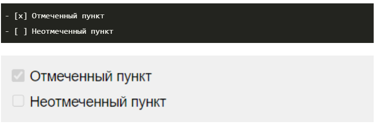
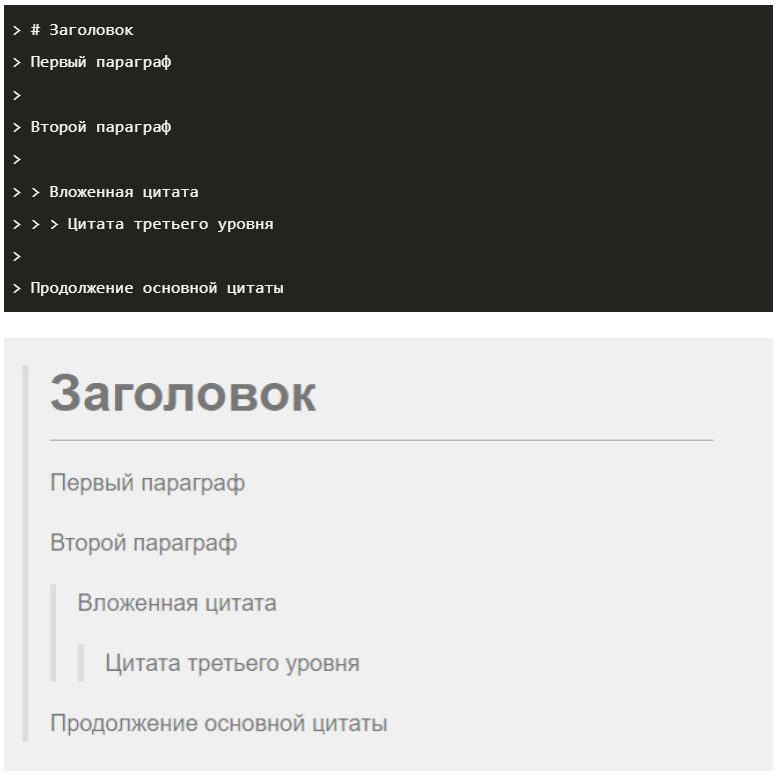
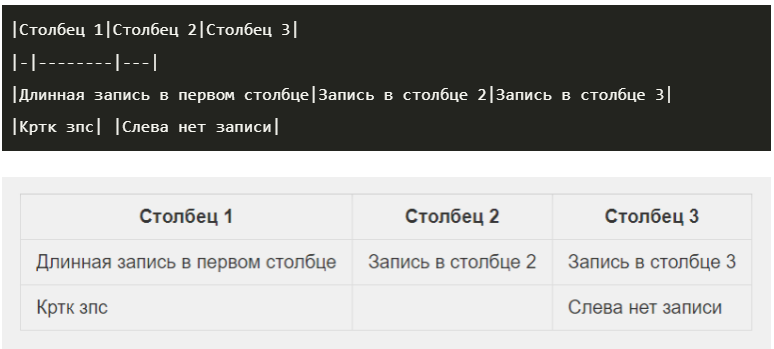

# Git. Инструкция использования Git.

## Что такое Git?

**Git** — это система контроля версий (VCS), которая позволяет отслеживать и фиксировать изменения в коде: вы можете восстановить код в случае сбоя или откатить до более ранних версий. А ещё это must-have инструмент для взаимодействия нескольких разработчиков на одном проекте. 

## Настройка Git.

Первое, что нужно сделать, — настроить имя пользователя и email для идентификации. Эти настройки хранятся в конфигурационном файле.

Вы можете напрямую отредактировать файл .gitconfig в текстовом редакторе или сделать это командой **git config --global --edit**. Для отдельных полей это **git config --global <поле> <значение>** — поля user.name и user.email.

Команда **git config --list** выведет все поля и их значения из конфигурационного файла.

## Создание репозитория.

Для инициализации нового репозитория .git подойдёт **git init** или, если хотите скопировать существующий, **git clone <адрес репозитория>**.

## Коммиты.

Основы работы с Git предполагают понимание коммитов. Команда **git commit -m** откроет текстовый редактор для ввода сообщения коммита.

Например: **git commit -m "Пофиксил баг"**.

Советы:

* Коммитьте как можно чаще.

* Одно изменение — один коммит: не помещайте все не связанные между собой изменения в один коммит, разделите их, чтобы было проще откатиться.

* Если у вас много незначительных изменений, хорошим тоном считается делать небольшие коммиты при разработке, а при добавлении в большой репозиторий объединять их в один коммит.

## Просмотр изменений в файловых системах.

Команда **git status** отображает все файлы, которые различаются между тремя разделами. 

У файлов есть 4 состояния:

- **Неотслеживаемый (untracked)** — находится в рабочей директории, но нет ни одной версии в HEAD или в области подготовленных файлов (Git не знает о файле).
- **Изменён (modified)** — в рабочей директории есть более новая версия по сравнению с хранящейся в HEAD или в области подготовленных файлов (изменения не находятся в следующем коммите).
- **Подготовлен (staged)** — в рабочей директории и области подготовленных файлов есть более новая версия по сравнению с хранящейся в HEAD (готов к коммиту).
- **Без изменений** — одна версия файла во всех разделах, т. е. в последнем коммите содержится актуальная версия.

**Примечание**: Файл может быть одновременно в состоянии «изменён» и «подготовлен», если версия в рабочей директории новее, чем в области подготовленных файлов, которая в свою очередь новее версии в HEAD.

Мы можем использовать опцию -s для команды git status, чтобы получить более компактный вывод (по строке на файл). Если файл не отслеживается, то будет выведено ??; если он был изменён, то его имя будет красным, а если подготовлен — зелёным.

Чтобы посмотреть сами изменения, а не изменённые файлы, можно использовать следующие команды:

- **git diff** — сравнение рабочей директории с областью подготовленных файлов;
- **git diff --staged** — сравнение области подготовленных файлов с HEAD.
Если использовать аргумент <файл/папка>, то diff покажет изменения только для указанных файлов/папок, например **git diff src/**.

## Обновление файловых систем.

Команда **git add <файл/папка>** обновляет область подготовленных файлов версиями файлов/папок из рабочей директории.

Команда **git commit -m** обновляет HEAD новым коммитом, который делает снимки файлов в области подготовленных файлов.

Команда **git checkout <файл>** перезаписывает версию файла в рабочей директории версией в области подготовленных файлов, то есть отменяет изменения с момента последней подготовленной версии.

## Игнорирование файлов.

## Просмотр изменений.

## Работа с ветками.

* **git init** - инициализирует новый репозиторий GIT и начинает отслеживание существующего каталога. В существующий каталог добавляется скрытая вложенная папка, в которой размещается внутренняя структура данных, необходимая для управления версиями.

* **git status** - показывает состояния файлов в рабочем каталоге и индексе: какие файлы изменены, но не добавлены в индекс; какие ожидают коммита в индексе. Вдобавок к этому выводятся подсказки о том, как изменить состояние файлов.

* **git add** - добавляет файл или файлы для последующего коммита.

* **git commit -m " "** - получает проиндексированный снимок состояния и выполняет его коммит в историю проекта. Эта команда в сочетании с командой git add определяет классический рабочий процесс для всех пользователей Git.

* **git log** - выводит весь список commit-ов с их хеш-кодами.

* **git checkout** - переход от одного commit-а  к другому.

* **git checkout master** - возвращает в актуальному состоянию файла.

* **git diff** - используется для вычисления разницы между любыми двумя Git деревьями.

# Markdown. Синтаксис.

## Содержание:

1. [Параграфы и разрывы строк (paragraphs and line breaks)](#title1)

2. [Заголовки (headings)](#title2)

3. [Выделение текста (emphasis)](#title3)

4. [Списки (lists)](#title4)

5. [Цитаты (blockquotes)](#title5)

6. [Ссылки (links)](#title6)

7. [Картинки (images)](#title7)

8. [Таблицы (tables)](#title8)

**Markdown** - облегчённый язык разметки, созданный с целью обозначения форматирования в простом тексте, с максимальным сохранением его читаемости человеком, и пригодный для машинного преобразования в языки для продвинутых публикаций (HTML, Rich Text и др.).

## <a id="title1">Параграфы и разрывы строк (paragraphs and line breaks)</a>

Чтобы поделить текст на параграфы, между ними нужно оставить пустую строку. Строка считается пустой, даже если в ней есть пробелы и табуляции. Если же строки находятся рядом, то они автоматически склеиваются в одну.

Пример в картинках:

Для переноса строки внутри одного параграфа есть три метода:

* поставить в конце строки два или больше пробела   ;
* поставить в конце строки обратную косую черту \;
* использовать HTML-тег < br >.

Пример в картинках:

Обратите внимание, что у каждого из методов есть свои недостатки:

* пробелы в конце строки бывает трудно заметить, и это может запутать читателя;
* обратный слеш вводится в стандарте CommonMark и может поддерживаться не всеми редакторами;
* HTML-теги в Markdown также поддерживаются не всеми редакторами.

## <a id="title2">Заголовки (headings) </a>

В синтаксисе Markdown есть шесть уровней заголовков: от H1 (самого большого) до H6 (самого маленького). Для их выделения используют решётки #, при этом есть несколько тонкостей:

* решётки можно ставить как перед заголовком, так и с двух сторон от него (на уровень заголовка влияют только те #, которые находятся перед ним);
* количество решёток соответствует уровню заголовка: одна для первого уровня, две для второго и так далее;
* между решёткой и текстом ставится пробел.

Пример:

# Заголовок первого уровня
## Заголовок второго уровня
### Заголовок третьего уровня
#### Заголовок четвертого уровня
##### Заголовок пятого уровня
###### Заголовок шестого уровня

Пример в картинках:

## <a id="title3">Выделение текста (emphasis)</a>

Чтобы изменить начертание текста, нужно выделить его с двух сторон спецсимволами следующим образом: <спецсимвол>текст<спецсимвол>.

### Курсив (italic)

Для выделения текста курсивом нужно использовать одну звёздочку * или нижнее подчёркивание _ .

Пример:

*Учим Markdown.*

Пример в картинках:

### Жирный (bold)

Для выделения текста жирным нужно использовать две звёздочки ** или два нижних подчёркивания __.

Пример:

**Учим Markdown.**

Пример в картинках:

### Жирный курсив (bold and italic)

Для выделения текста сразу обоими стилями нужно использовать три звёздочки *** или три нижних подчёркивания ___.

Пример: 

***Учим Markdown.***

Пример в картинках:

### Зачёркнутый(strikethrough)

Чтобы зачеркнуть текст, нужно использовать две тильды ~~. Такая опция есть только в диалекте GitHub Flavored Markdown.

Пример:

~~Учим Markdown.~~

Пример в картинках:

## <a id="title4">Списки (lists)</a>

В синтаксисе Markdown есть несколько видов списков. Для их оформления перед каждым пунктом нужно поставить подходящий тег и отделить его от текста пробелом.

### Нумерованные (ordered)

Для создания нумерованного списка перед пунктами нужно поставить число с точкой. При этом нумерация в разметке ленивая. Неважно, какие именно числа вы напишете: Markdown пронумерует список автоматически.

Пример:

1. Учим Markdown.
2. Учим Markdown с Сергеем Сердюком.

Пример в картинках:

### Ненумерованные (unordered)

Для создания ненумерованного списка нужно поставить перед каждым пунктом звёздочку *, дефис - или плюс +.

Пример:

* Учим Markdown.
- Учим Markdown с Сергеем Сердюком.

Пример в картинках:

### Чекбоксы (checkboxes)

Чтобы сделать чекбоксы, нужно использовать маркированный список, но между маркером и текстом поставить [x] для отмеченного пункта и [] — для неотмеченного.

Чекбоксы доступны в диалекте GitHub Flavored Markdown (тот самый, который умеет зачёркивать текст) и поддерживаются не всеми редакторами Markdown.

Пример:

## <a id="title5"> Цитаты (blockquotes) </a> 

Чтобы параграф отобразился как цитата, нужно поставить перед ним закрывающую угловую скобку >.

Внутрь одного блока цитаты можно поместить сразу несколько параграфов и использовать любые элементы оформления. Например, заголовки и другие цитаты. Чтобы сделать это, нужно поместить закрывающую угловую скобку перед началом каждой строки.

Пример:

> # Учим Markdown.
>Учим Markdown с Сергеем Сердюком.

Пример в картинках:

## <a id="title6">Ссылки (links)</a>

Самый лёгкий способ поместить ссылку в Markdown — заключить её в угловые скобки. Несмотря на простоту, он не является основным и был добавлен только в спецификации CommonMark.

Пример:

<https://gb.ru/>

Чтобы оформить ссылкой часть текста, используется такой синтаксис: [текст](ссылка). Можно сделать всплывающую подсказку при наведении курсора. Для этого в круглых скобках после ссылки нужно поставить пробел и написать текст подсказки в кавычках.

Пример:

[GeekBrains](https://gb.ru/) без подсказки

[GeekBrains](https://gb.ru/ "GeekBrains") с подсказкой

## <a id="title7">Картинки (images)</a>

Изображения в Markdown оформляются по принципу, схожему с принципом оформления ссылкок, только перед квадратными скобками нужно поставить восклицательный знак: . Здесь также можно сделать всплывающую подсказку.

Пример:

## <a id="title8">Таблицы (tables)</a>

В уже упомянутом выше диалекте GitHub Flavored Markdown (и некоторых других тоже) есть возможность оформлять таблицы. Столбцы разделяются вертикальными линиями |, а строка с шапкой отделяется от остальных дефисами -, которых можно ставить сколько угодно.

Пример:

