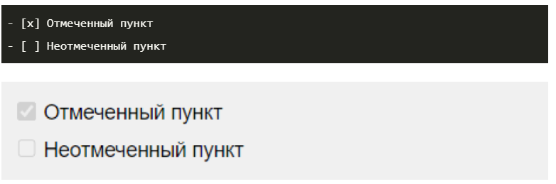
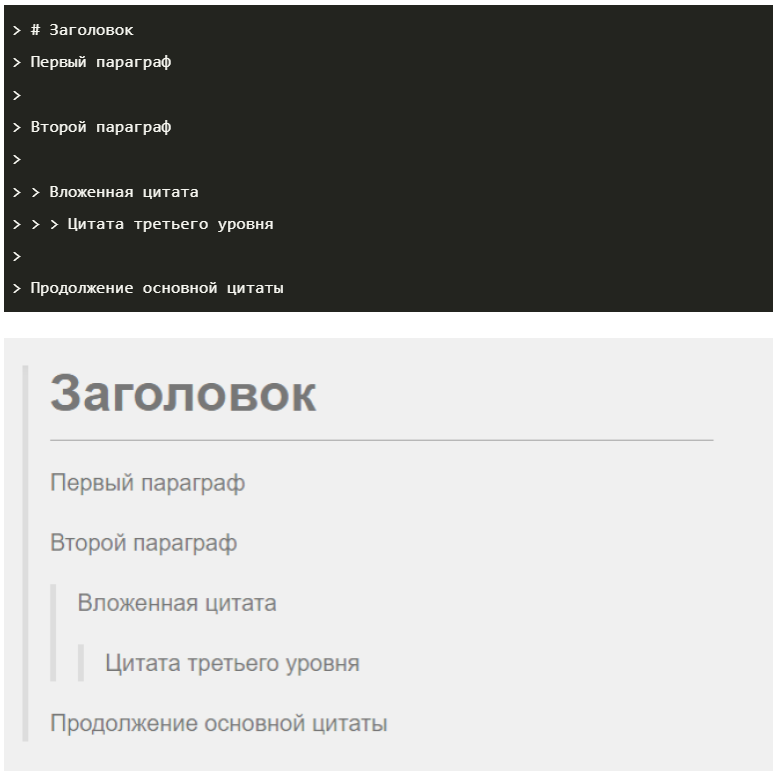

# Git. Основные команды.

* **git init** - инициализирует новый репозиторий GIT и начинает отслеживание существующего каталога. В существующий каталог добавляется скрытая вложенная папка, в которой размещается внутренняя структура данных, необходимая для управления версиями.

* **git status** - показывает состояния файлов в рабочем каталоге и индексе: какие файлы изменены, но не добавлены в индекс; какие ожидают коммита в индексе. Вдобавок к этому выводятся подсказки о том, как изменить состояние файлов.

* **git add** - добавляет файл или файлы для последующего коммита.

* **git commit -m " "** - получает проиндексированный снимок состояния и выполняет его коммит в историю проекта. Эта команда в сочетании с командой git add определяет классический рабочий процесс для всех пользователей Git.

* **git log** - выводит весь список commit-ов с их хеш-кодами.

* **git checkout** - переход от одного commit-а  к другому.

* **git checkout master** - возвращает в актуальному состоянию файла.

* **git diff** - используется для вычисления разницы между любыми двумя Git деревьями.

# Markdown. Синтаксис.

**Markdown** - облегчённый язык разметки, созданный с целью обозначения форматирования в простом тексте, с максимальным сохранением его читаемости человеком, и пригодный для машинного преобразования в языки для продвинутых публикаций (HTML, Rich Text и др.).

## Параграфы и разрывы строк (paragraphs and line breaks)

Чтобы поделить текст на параграфы, между ними нужно оставить пустую строку. Строка считается пустой, даже если в ней есть пробелы и табуляции. Если же строки находятся рядом, то они автоматически склеиваются в одну.

Пример:

Для переноса строки внутри одного параграфа есть три метода:

* поставить в конце строки два или больше пробела   ;
* поставить в конце строки обратную косую черту \;
* использовать HTML-тег < br >.

Пример:

Обратите внимание, что у каждого из методов есть свои недостатки:

* пробелы в конце строки бывает трудно заметить, и это может запутать читателя;
* обратный слеш вводится в стандарте CommonMark и может поддерживаться не всеми редакторами;
* HTML-теги в Markdown также поддерживаются не всеми редакторами.

## Заголовки (headings)

В синтаксисе Markdown есть шесть уровней заголовков: от H1 (самого большого) до H6 (самого маленького). Для их выделения используют решётки #, при этом есть несколько тонкостей:

* решётки можно ставить как перед заголовком, так и с двух сторон от него (на уровень заголовка влияют только те #, которые находятся перед ним);
* количество решёток соответствует уровню заголовка: одна для первого уровня, две для второго и так далее;
* между решёткой и текстом ставится пробел.

Пример:

## Выделение текста (emphasis)

Чтобы изменить начертание текста, нужно выделить его с двух сторон спецсимволами следующим образом: <спецсимвол>текст<спецсимвол>.

### Курсив (italic)

Для выделения текста курсивом нужно использовать одну звёздочку * или нижнее подчёркивание _ .

Пример:

### Жирный (bold)

Для выделения текста жирным нужно использовать две звёздочки ** или два нижних подчёркивания __.

Пример:

### Жирный курсив (bold and italic)

Для выделения текста сразу обоими стилями нужно использовать три звёздочки *** или три нижних подчёркивания ___.

Пример: 

### Зачёркнутый (strikethrough)

Чтобы зачеркнуть текст, нужно использовать две тильды ~~. Такая опция есть только в диалекте GitHub Flavored Markdown.

Пример:

## Списки (lists)

В синтаксисе Markdown есть несколько видов списков. Для их оформления перед каждым пунктом нужно поставить подходящий тег и отделить его от текста пробелом.

### Нумерованные (ordered)

Для создания нумерованного списка перед пунктами нужно поставить число с точкой. При этом нумерация в разметке ленивая. Неважно, какие именно числа вы напишете: Markdown пронумерует список автоматически.

Пример:

### Ненумерованные (unordered)

Для создания ненумерованного списка нужно поставить перед каждым пунктом звёздочку *, дефис - или плюс +.

Пример:

### Чекбоксы (checkboxes)

Чтобы сделать чекбоксы, нужно использовать маркированный список, но между маркером и текстом поставить [x] для отмеченного пункта и [] — для неотмеченного.

Чекбоксы доступны в диалекте GitHub Flavored Markdown (тот самый, который умеет зачёркивать текст) и поддерживаются не всеми редакторами Markdown.

Пример:

## Цитаты (blockquotes)

Чтобы параграф отобразился как цитата, нужно поставить перед ним закрывающую угловую скобку >.

Внутрь одного блока цитаты можно поместить сразу несколько параграфов и использовать любые элементы оформления. Например, заголовки и другие цитаты. Чтобы сделать это, нужно поместить закрывающую угловую скобку перед началом каждой строки.

Пример:

